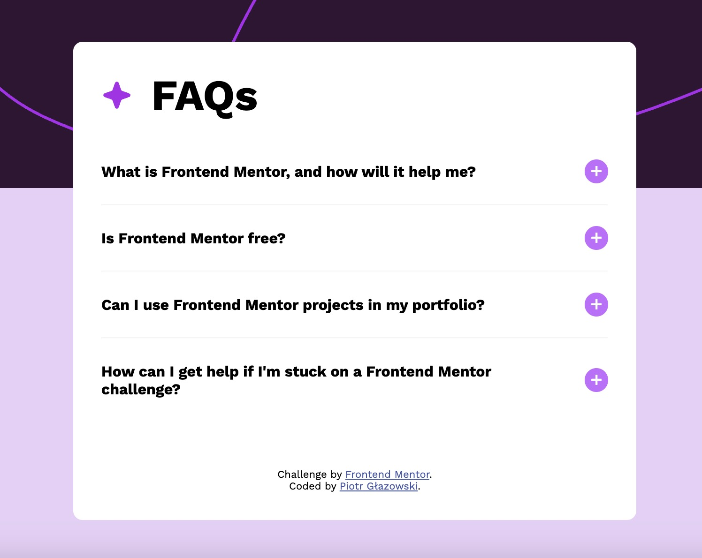

# FAQ Accordion Component

This is a solution to the [Frontend Mentor FAQ accordion challenge](https://www.frontendmentor.io/challenges/faq-accordion-WYV1bWy74). The goal was to build a responsive FAQ accordion using HTML, CSS, and JavaScript.

## 🚀 Overview

### Screenshot



➡️ Live site: https://dzik0.github.io/faq-accordion

### Built With

- Semantic **HTML5**
- **CSS3** (Flexbox, Responsive Design)
- **Vanilla JavaScript**
- [Google Fonts – Work Sans](https://fonts.google.com/specimen/Work+Sans)

### Features

- Responsive design
- Smooth accordion-style FAQ toggle
- Custom JavaScript logic for opening/closing questions
- Clean and modern layout

## 📚 What I Learned

- How to structure FAQ content semantically
- DOM manipulation in vanilla JavaScript
- Toggle functionality with classes and inner text
- Designing for responsiveness

## 🔧 How to Use

1. Clone the repo:

   ```bash
   git clone https://github.com/your-username/faq-accordion.git
   ```

2. Navigate to the project folder:

   ```bash
   cd faq-accordion
   ```

3. Open `index.html` in your browser.

## 📁 Folder Structure

```
.
├── assets/
│   └── images/
│       ├── favicon-32x32.png
│       └── icon-star.svg
├── main.css
├── index.html
└── README.md
```

## 💡 Acknowledgments

- Challenge provided by [Frontend Mentor](https://www.frontendmentor.io)
- Developed by **Piotr Głazowski**

## 📝 License

This project is for learning purposes and is not licensed for commercial use.

---
